# Half-Guard for Begingers

First part should be to give an understanding of somebody that never to play this position willfuly.

## Playing Half Guard
 
### Part 1 - Entering HG as defensive position

1. Understanding what's half guard
   1. Guard is like an onion, half guard is the center
   2. Close guard vs half guard
   3. Trade offs
      1. Easy to enter / Easy to be force
      2. High skill cealing
      3. Athletism is less of a factor
3. Transitions
   1. Escape side control cross face + underhook -> elbow escape -> half
   2. Transitioning into mount -> Catch leg ->  half
   3. Mount -> elgow escape -> half
3. Half guard - upgrades
   1. Butterfly hook
   2. High knee shield
   3. Low knee shield
4. Half guard - downgrades
   1. Underhook + cross face
   2. Knee pointing away
   3. Knee pointer toward the sky, being "flat"
5. Transitions
   1. Cross faced -> Bridge roll reversal -> Top half
   2. Cross faced ->  Elbow escape -> Half butterfly
   3. Cross faced -> Bridge roll reversal -> Elbow escape -> Half
6. When is the cross-face good or bad? 
   1. Cross face vs underhook distinction
   2. Close guard example 
7. Transitions
   1. Upgrade to close guard
   2. Butterfly sweep
   3. Shoulder crunch
8. Passer get's up
   1. Upgrade to close guard
   2. Lockdown bring down

### Part 2 - Counter attacks

### Part 3 - Settings up traps & upgrades

### Part 4 - Real life sequences

## Passing Half guard

### Winning conditions & neutralizing counters

### Passing on inside

### Passing on the outside

### Real life sequences